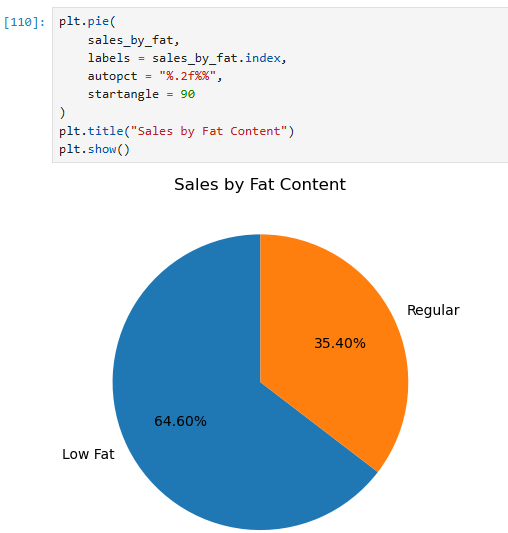
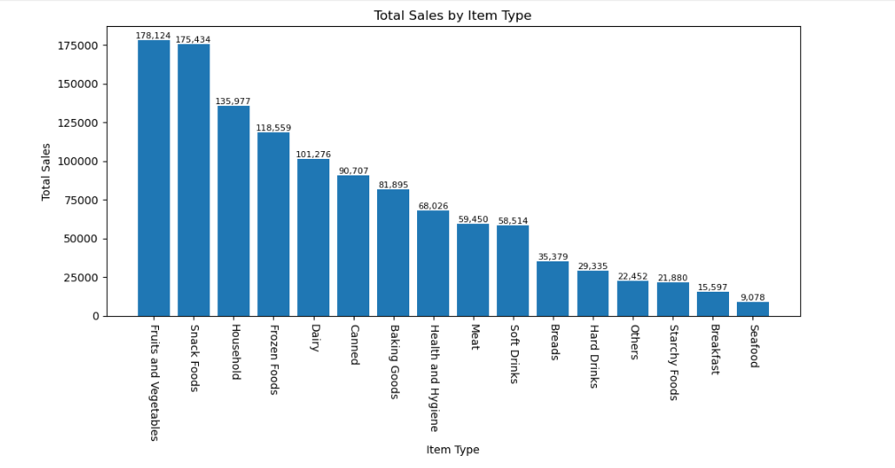
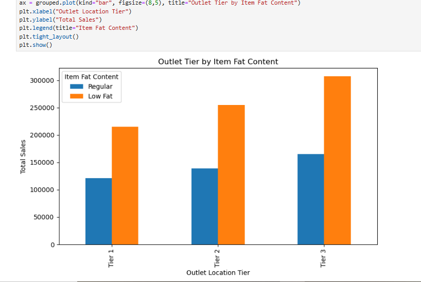
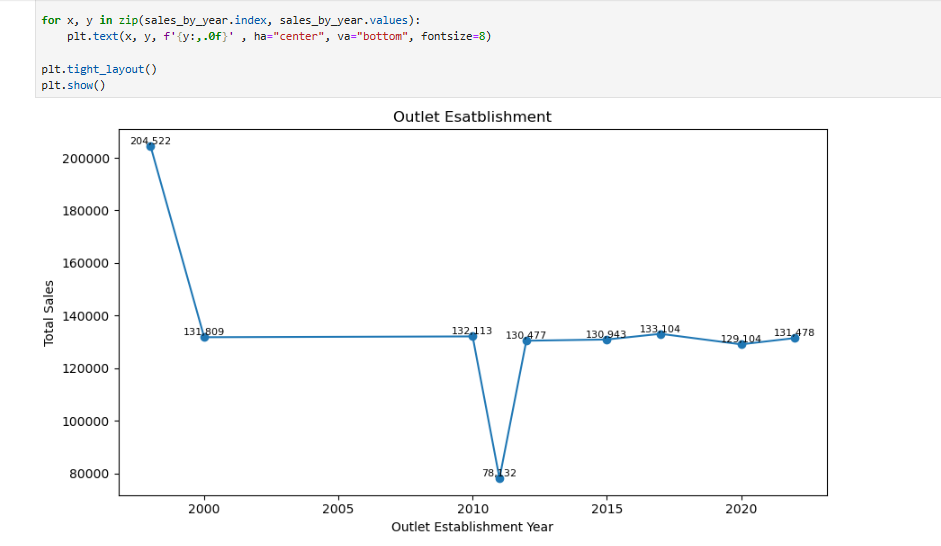
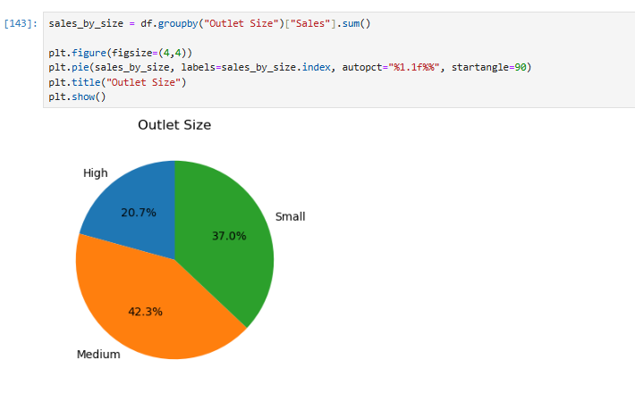
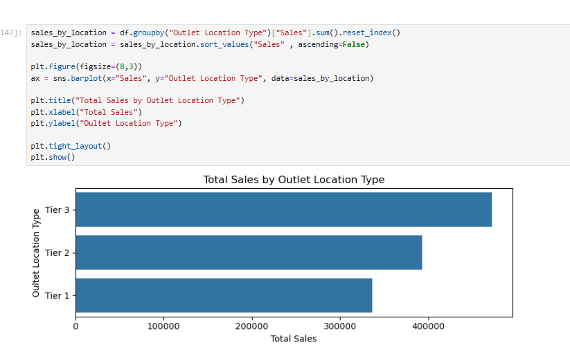

# 🛍️ Blinkit Sales Analysis Project

In this project, I analyzed the **Blinkit Sales Dataset** to uncover trends in sales, generate actionable business insights, and create data visualizations to support data-driven decision-making.

## 🎯 Project Objective

The objective of this project is to perform **data cleaning**, **analysis**, and **visualization** on the *Blinkit Dataset* to:

- Understand **sales trends across various product categories**
- Analyze the impact of **item fat content** on sales
- Study **outlet establishment and location factors** affecting sales performance

## 📂 Dataset Used

- **Name**: *Blinkit Sales Dataset*
- **Records**: 8,523 entries
- **Attributes**:  
  `Item Fat Content`, `Item Identifier`, `Item Type`, `Outlet Establishment Year`,  
  `Outlet Identifier`, `Outlet Location Type`, `Outlet Size`, `Outlet Type`,  
  `Item Visibility`, `Item Weight`, `Sales`, `Rating`
- **Source**: <a href="https://github.com/VikasSharma0052/Blinkit-Analysis/blob/main/blinkit_data.csv">Provided Dataset File</a>

## ❓ Key Questions (KPIs)

1. 🛒 How does **item fat content** impact sales?
2. 🏷️ Which **item types** contribute most to sales?
3. 🗺️ What is the **relationship between outlet location and sales**?
4. 🏢 How does **outlet establishment year** affect total sales?
5. 🔏 Which **outlet size** generates the highest sales?
6. 📍 How are sales distributed across **outlet location types**?

## ⚙️ Process Followed

1. 🔍 **Data Cleaning**:
   - Checked for **null values** and handled missing data appropriately.
   - Removed **duplicate values**.
   - Standardized **Item Fat Content** by removing similar names and typos.

2. 📈 **Statistical Analysis**:
   - Performed descriptive statistical analysis for numerical columns.
   - Explored relationships between variables.

3. 📊 **Visualization**:
   - Generated relevant bar plots, pie charts, and statistical visualizations using:
     - `Matplotlib`
     - `Seaborn`
     - `Pandas`
     - `NumPy`

## 📸 Visualizations

### 1️⃣ Sales by Fat Content

### 2️⃣ Total Sales by Item Type

### 3️⃣ Outlet Tier by Item Fat Content

### 4️⃣ Sales by Outlet Establishment Year

### 5️⃣ Sales by Outlet Size

### 6️⃣ Total Sales by Outlet Location Type

## 🧠 Project Insights

1. 🥗 **Item Fat Content**:
   - **Low Fat Content** accounts for **64.60% of total sales**.

2. 🛒 **Item Type**:
   - **Fruit and Vegetables** is the **highest-selling category**, contributing **₹178K** in sales.

3. 🌍 **Outlet Tier by Fat Content**:
   - **Tier 3 outlets** lead in sales.
   - Within Tier 3, **Low Fat** products dominate.

4. 🏢 **Outlet Establishment Year**:
   - **Outlets established in 2000** generated the **highest sales of ₹204K**.

5. 🏣 **Outlet Size**:
   - **Medium-sized outlets** contribute the most, accounting for **42.3% of total sales**.

6. 📍 **Outlet Location Type**:
   - **Tier 3 outlet locations** dominate, with total sales **exceeding ₹400K**.

## ✅ Final Conclusion

The analysis highlights that **Low Fat** products drive the majority of sales, especially in **Tier 3** outlet locations. **Fruit and Vegetables** emerge as the top-selling item type. **Outlets established in 2000** and **medium-sized outlets** show superior sales performance. These insights can help Blinkit optimize product offerings, strengthen supply chains in Tier 3 locations, and focus marketing efforts on popular, high-performing categories. A strategic focus on these factors will help maximize revenue and improve customer engagement.
